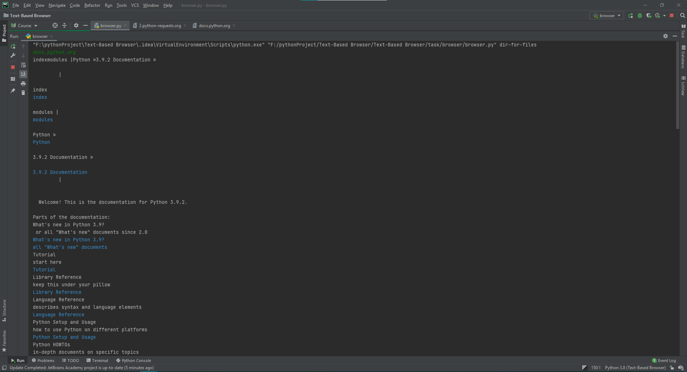

# Text_Based_browser

### Данный проект был написан как проект трека Python Developer платформы JetBrains Academy

Задание(переведено):
>Возможность прочитать онлайн-документацию или найти что-то в Интернете из командной строки или терминала может действительно пригодиться. Давайте воспользуемся Python для создания текстового браузера. В этом проекте вы создадите упрощенный браузер, который будет игнорировать JS и CSS, не будет иметь файлов cookie и будет отображать только ограниченный набор тегов. Но в некоторых ситуациях его все равно будет достаточно, и строить его будет весело!
Результаты обучения
В этом проекте вы узнаете, как работает HTTP и как с ним работать в Python. Вы познакомитесь с вводом и выводом Python. Вам также потребуется проанализировать HTML, так что вы тоже получите некоторый опыт в этом.

Это приложение является упрощенной версией браузера: оно умеет делать делать запроы и отображать содержимое сайтов(частично: отображает только содержимое a, p, ul, ol и li тегов). Содержимое выводится в созданные файлы в директории dir_for_files и в консоль. Причем содержимое a тегов выводится в консоль синим цветом.

Работа приложения:

